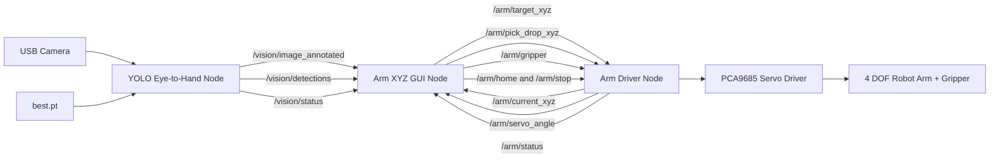

# Robot Arm 4 DOF ROS 2 Humble with Kinematics and YOLO

[](https://docs.ros.org/en/humble/)
[](https://www.python.org/)
[](https://docs.ultralytics.com/)
[](#license)

Robot arm 4 DOF berbasis ROS 2 Humble yang menggabungkan kontrol servo melalui PCA9685, forward/inverse kinematics, GUI Tkinter, dan deteksi objek YOLO untuk skenario eye-to-hand pick-and-drop.

This project is a ROS 2 Humble based 4 DOF robot arm system that combines PCA9685 servo control, forward/inverse kinematics, a Tkinter GUI, and YOLO object detection for eye-to-hand pick-and-drop experiments.

## Features

- Robot arm 4 DOF plus gripper with PCA9685 servo driver.
- Forward kinematics and inverse kinematics for XYZ target movement.
- Automatic gripper close after reaching pick target and gripper open after drop.
- Tkinter GUI for manual XYZ input, top-view command, visual robot state, and camera view.
- YOLO camera node that publishes annotated images and detection data through ROS topics.
- Eye-to-hand calibration using 4-point homography from camera pixels to robot coordinates.
- ROS 2 topic based architecture for driver, GUI, status, vision, and pick-drop workflow.

## System Architecture



## Project Structure

| File | Description |
| --- | --- |
| `arm_driver_auto_grip.py` | ROS 2 node for kinematics, servo control, gripper automation, home, stop, and pick-drop execution. |
| `arm_xyz_input_auto_grip.py` | Tkinter GUI and ROS 2 node for XYZ input, camera display, detection table, visual robot state, and eye-to-hand calibration. |
| `camera_yolo_eye_to_hand.py` | ROS 2 camera node for running YOLO inference, publishing annotated image frames, detections, and vision status. |
| `best.pt` | Trained YOLO model used by the camera node. |
| `requirements.txt` | Python dependencies outside the standard ROS 2 Humble packages. |

## Hardware Requirements

- Robot arm 4 DOF with 1 gripper.
- 5 servo motors connected through PCA9685:
  - CH0: base
  - CH1: shoulder
  - CH2: elbow
  - CH3: wrist
  - CH4: gripper
- PCA9685 servo driver using I2C.
- USB camera or compatible camera source.
- Linux/ROS 2 compatible board or computer. Raspberry Pi or similar hardware is recommended for I2C access.
- External servo power supply matched to the servo requirements.

## Software Requirements

- Ubuntu 22.04 or compatible Linux environment.
- ROS 2 Humble.
- Python 3.
- ROS packages that provide `rclpy`, `std_msgs`, `sensor_msgs`, and `cv_bridge`.
- Python dependencies listed in `requirements.txt`.

Install Python dependencies:

```bash
pip install -r requirements.txt
```

If you are using ROS 2 Humble on Ubuntu, make sure the ROS environment is sourced before running the nodes:

```bash
source /opt/ros/humble/setup.bash
```

For Raspberry Pi or hardware with PCA9685, enable I2C before running the arm driver.

## Running the Project

Run each component in a separate terminal.

Terminal 1 - robot arm driver:

```bash
python3 arm_driver_auto_grip.py
```

Terminal 2 - YOLO eye-to-hand camera:

```bash
python3 camera_yolo_eye_to_hand.py --ros-args -p model_path:=best.pt -p camera_source:=2
```

Terminal 3 - GUI control panel:

```bash
python3 arm_xyz_input_auto_grip.py
```

Adjust `camera_source` if your camera index is different. Common values are `0`, `1`, or `2`.

## ROS Interfaces

### Arm Driver Subscriptions

| Topic | Type | Data |
| --- | --- | --- |
| `/arm/target_xyz` | `std_msgs/Float64MultiArray` | `[x, y, z, duration]` |
| `/arm/pick_drop_xyz` | `std_msgs/Float64MultiArray` | `[pick_x, pick_y, pick_z, pick_duration, drop_x, drop_y, drop_z, drop_duration]` |
| `/arm/gripper` | `std_msgs/Float64` | Gripper angle |
| `/arm/home` | `std_msgs/Empty` | Move arm to home position |
| `/arm/stop` | `std_msgs/Empty` | Request stop |

### Arm Driver Publishers

| Topic | Type | Data |
| --- | --- | --- |
| `/arm/current_xyz` | `std_msgs/Float64MultiArray` | `[x, y, z, pitch]` |
| `/arm/servo_angle` | `std_msgs/Float64MultiArray` | `[base, shoulder, elbow, wrist, gripper]` |
| `/arm/status` | `std_msgs/String` | Arm status text |

### Vision Publishers

| Topic | Type | Data |
| --- | --- | --- |
| `/vision/image_annotated` | `sensor_msgs/Image` | YOLO annotated camera frame |
| `/vision/detections` | `std_msgs/String` | JSON detection packet with image size, timestamp, bounding boxes, labels, confidence, and centers |
| `/vision/status` | `std_msgs/String` | Camera and YOLO status text |

### Camera Node Parameters

| Parameter | Default | Description |
| --- | --- | --- |
| `model_path` | `best.pt` | YOLO model path |
| `camera_source` | `2` | Camera index or stream path |
| `confidence` | `0.5` | YOLO confidence threshold |
| `publish_hz` | `15.0` | Publish rate for image and detection topics |

## Kinematics Notes

The arm model uses the following link lengths:

| Link | Length |
| --- | --- |
| `L1` | 10 cm |
| `L2` | 12 cm |
| `L3` | 8 cm |
| `L4` | 16 cm |

Coordinate convention:

- `X`: left/right of robot.
- `Y`: forward direction.
- `Z`: upward direction.

Home model:

- Base: `0 deg`
- Shoulder: `90 deg`
- Elbow: `-90 deg`
- Wrist: `0 deg`

Home end-effector position:

- `X = 0 cm`
- `Y = 24 cm`
- `Z = 22 cm`

The driver computes IK candidates, filters them using servo limits, and chooses a valid solution for the requested XYZ target. During pick movement, the wrist attempts to keep the gripper facing downward, then straightens the wrist after the gripper closes.

## Eye-to-Hand Calibration

The GUI supports 4-point eye-to-hand calibration. The calibration maps camera pixel coordinates into robot coordinates using OpenCV homography.

Generated calibration data is stored locally in:

```text
eye_to_hand_calibration.json
```

This file is ignored by Git because calibration depends on camera placement, robot position, and workspace setup.

## Safety Notes

- Power servos with a proper external supply. Do not rely on logic power for servo current.
- Verify servo direction, pulse range, and mechanical limits before running automated pick-drop commands.
- Keep the workspace clear before enabling motion.
- Use `/arm/stop` or the GUI stop control if the arm movement becomes unsafe.

## License

No license is specified for this repository.
