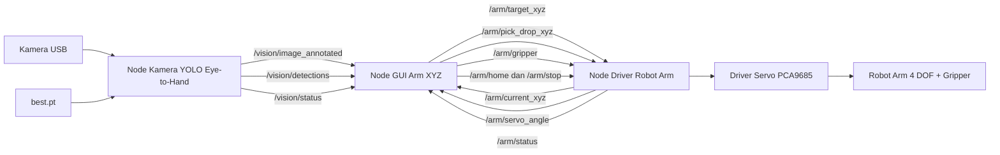

# Robot Arm 4 DOF Berbasis ROS 2 Humble dengan Kinematika dan YOLO

[](https://docs.ros.org/en/humble/)
[](https://www.python.org/)
[](https://docs.ultralytics.com/)
[](#lisensi)

Project ini merupakan sistem robot arm 4 DOF dengan 1 gripper yang dibangun menggunakan ROS 2 Humble. Sistem ini menggabungkan kontrol servo melalui PCA9685, perhitungan kinematika maju dan kinematika balik, antarmuka GUI berbasis Tkinter, serta deteksi objek YOLO untuk skenario eye-to-hand pick-and-drop.

## Fitur Utama

- Kontrol robot arm 4 DOF dan gripper menggunakan driver servo PCA9685.
- Kinematika maju untuk membaca posisi end-effector.
- Kinematika balik untuk menggerakkan robot berdasarkan input koordinat X, Y, dan Z.
- Gerakan pick-and-drop otomatis dengan gripper close dan open secara otomatis.
- GUI Tkinter untuk input target, monitoring posisi, tampilan kamera, dan visualisasi robot.
- Deteksi objek YOLO melalui kamera eye-to-hand.
- Kalibrasi eye-to-hand menggunakan 4 titik dan homography OpenCV.
- Komunikasi antar modul menggunakan topic ROS 2.

## Arsitektur Sistem



## Isi Repository

Repository ini dibuat ringkas dan hanya berisi file utama project.

| File | Keterangan |
| --- | --- |
| `arm_driver_auto_grip.py` | Node ROS 2 untuk kontrol servo, kinematika, home, stop, gripper otomatis, dan eksekusi pick-and-drop. |
| `arm_xyz_input_auto_grip.py` | GUI Tkinter sekaligus node ROS 2 untuk input XYZ, visualisasi robot, tampilan kamera, tabel deteksi, dan kalibrasi eye-to-hand. |
| `camera_yolo_eye_to_hand.py` | Node ROS 2 untuk membaca kamera, menjalankan YOLO, dan mengirim hasil deteksi ke topic ROS. |
| `best.pt` | Model YOLO hasil training yang digunakan untuk deteksi objek. |

## Kebutuhan Perangkat Keras

- Robot arm 4 DOF dengan 1 gripper.
- 5 servo motor:
  - CH0: base
  - CH1: shoulder
  - CH2: elbow
  - CH3: wrist
  - CH4: gripper
- Driver servo PCA9685 dengan komunikasi I2C.
- Kamera USB atau kamera lain yang kompatibel dengan OpenCV.
- Komputer atau board yang mendukung ROS 2 Humble dan akses I2C.
- Power supply eksternal untuk servo.

## Kebutuhan Perangkat Lunak

- Ubuntu 22.04 atau environment Linux yang kompatibel.
- ROS 2 Humble.
- Python 3.
- Package ROS untuk `rclpy`, `std_msgs`, `sensor_msgs`, dan `cv_bridge`.
- Library Python:
  - `ultralytics`
  - `opencv-python`
  - `numpy`
  - `pillow`
  - `adafruit-blinka`
  - `adafruit-circuitpython-pca9685`
  - `adafruit-circuitpython-motor`

Contoh instalasi library Python:

```bash
pip install ultralytics opencv-python numpy pillow adafruit-blinka adafruit-circuitpython-pca9685 adafruit-circuitpython-motor
```

Sebelum menjalankan program, pastikan environment ROS 2 Humble sudah aktif:

```bash
source /opt/ros/humble/setup.bash
```

Jika menggunakan Raspberry Pi atau board sejenis, pastikan I2C sudah diaktifkan agar PCA9685 dapat terbaca.

## Cara Menjalankan

Jalankan setiap komponen pada terminal yang berbeda.

Terminal 1 - driver robot arm:

```bash
python3 arm_driver_auto_grip.py
```

Terminal 2 - kamera YOLO eye-to-hand:

```bash
python3 camera_yolo_eye_to_hand.py --ros-args -p model_path:=best.pt -p camera_source:=2
```

Terminal 3 - GUI kontrol robot:

```bash
python3 arm_xyz_input_auto_grip.py
```

Jika kamera tidak terbaca, ubah nilai `camera_source` menjadi index kamera yang sesuai, misalnya `0`, `1`, atau `2`.

## Topic ROS 2

### Subscribe pada Driver Robot Arm

| Topic | Tipe Pesan | Format Data |
| --- | --- | --- |
| `/arm/target_xyz` | `std_msgs/Float64MultiArray` | `[x, y, z, duration]` |
| `/arm/pick_drop_xyz` | `std_msgs/Float64MultiArray` | `[pick_x, pick_y, pick_z, pick_duration, drop_x, drop_y, drop_z, drop_duration]` |
| `/arm/gripper` | `std_msgs/Float64` | Sudut gripper |
| `/arm/home` | `std_msgs/Empty` | Perintah kembali ke posisi home |
| `/arm/stop` | `std_msgs/Empty` | Perintah berhenti |

### Publish dari Driver Robot Arm

| Topic | Tipe Pesan | Format Data |
| --- | --- | --- |
| `/arm/current_xyz` | `std_msgs/Float64MultiArray` | `[x, y, z, pitch]` |
| `/arm/servo_angle` | `std_msgs/Float64MultiArray` | `[base, shoulder, elbow, wrist, gripper]` |
| `/arm/status` | `std_msgs/String` | Status robot arm |

### Publish dari Node Kamera YOLO

| Topic | Tipe Pesan | Keterangan |
| --- | --- | --- |
| `/vision/image_annotated` | `sensor_msgs/Image` | Frame kamera yang sudah diberi anotasi YOLO |
| `/vision/detections` | `std_msgs/String` | Data JSON berisi ukuran gambar, timestamp, bounding box, label, confidence, dan titik tengah objek |
| `/vision/status` | `std_msgs/String` | Status kamera dan model YOLO |

## Parameter Node Kamera

| Parameter | Nilai Default | Keterangan |
| --- | --- | --- |
| `model_path` | `best.pt` | Path model YOLO |
| `camera_source` | `2` | Index kamera atau path stream |
| `confidence` | `0.5` | Ambang confidence YOLO |
| `publish_hz` | `15.0` | Frekuensi publish frame dan hasil deteksi |

## Kinematika Robot

Sistem menggunakan panjang link sebagai berikut:

| Link | Panjang |
| --- | --- |
| `L1` | 10 cm |
| `L2` | 12 cm |
| `L3` | 8 cm |
| `L4` | 16 cm |

Konvensi koordinat:

- `X`: arah kiri atau kanan robot.
- `Y`: arah depan robot.
- `Z`: arah atas robot.

Posisi home model:

- Base: `0 derajat`
- Shoulder: `90 derajat`
- Elbow: `-90 derajat`
- Wrist: `0 derajat`

Posisi home end-effector:

- `X = 0 cm`
- `Y = 24 cm`
- `Z = 22 cm`

Driver robot menghitung beberapa kandidat solusi inverse kinematics, memfilter solusi berdasarkan batas servo, lalu memilih solusi valid untuk mencapai target XYZ. Saat proses pick, sistem mencoba membuat gripper menghadap ke bawah, menutup gripper setelah target tercapai, lalu meluruskan wrist kembali.

## Kalibrasi Eye-to-Hand

GUI mendukung kalibrasi eye-to-hand menggunakan 4 titik. Kalibrasi ini mengubah koordinat pixel kamera menjadi koordinat robot dengan homography dari OpenCV.

File kalibrasi lokal yang dapat terbentuk saat program berjalan:

```text
eye_to_hand_calibration.json
```

File tersebut bergantung pada posisi kamera dan setup meja kerja, sehingga tidak disertakan sebagai file utama repository.

## Catatan Keselamatan

- Gunakan power supply eksternal yang sesuai untuk servo.
- Periksa arah servo, batas mekanik, dan pulse range sebelum menjalankan gerakan otomatis.
- Pastikan area kerja robot aman dan tidak terhalang.
- Gunakan tombol stop pada GUI atau topic `/arm/stop` jika gerakan robot tidak sesuai.

## Lisensi

Repository ini tidak mencantumkan lisensi.
